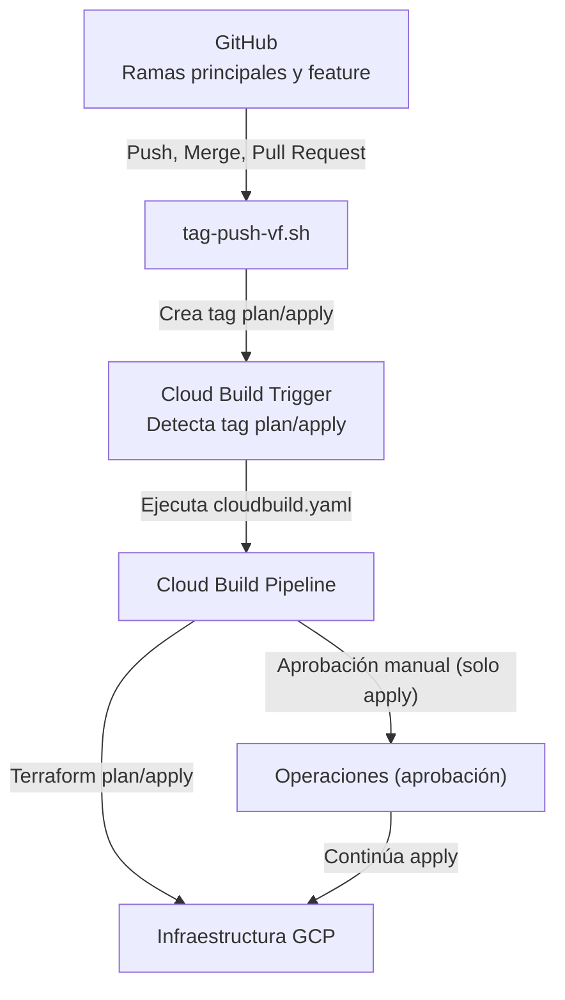

# Repositorio Terraform Cloud Build GitOps GCP

Este repositorio implementa la gestión de infraestructura como código (IaC) en Google Cloud Platform usando Terraform, Cloud Build y GitOps. Todos los módulos son de creación propia y utilizan el provider `google` versión `~> 7.20`.

## Estructura del Repositorio

```text
.
├── modules/
│   ├── cloud_nat/
│   ├── cloud_router/
│   ├── Cloud_Storage/
│   ├── composer/
│   ├── firewall/
│   ├── http_server/
│   ├── key_management/
│   ├── Network/
│   ├── shared_vpc/
│   ├── vpc/
│   └── vpc_routes/
├── Projects Development/
│   ├── ejemplo-proyecto-id/
│   └── rs-app-tier-2/
│       ├── backend.tf
│       ├── config/
│       ├── locals.tf
│       ├── main.tf
│       ├── outputs.tf
│       ├── provider.tf
│       ├── terraform.tfvars
│       ├── variables.tf
│       └── versions.tf
├── Projects Production/
│   ├── ejemplo-proyecto-id/
│   ├── prod/
│   ├── rs-app-tier-1/
│   └── rs-web-tier/
│       ├── backend.tf
│       ├── config/
│       ├── locals.tf
│       ├── main.tf
│       ├── outputs.tf
│       ├── provider.tf
│       ├── terraform.tfvars
│       ├── variables.tf
│       └── versions.tf
├── Projects Networking/
│   └── ejemplo-proyecto-id/
├── cloudbuild.yaml
├── tag-push-vf.sh
└── ...
```

- **modules/**: Módulos de creación propia para recursos GCP (VPC, NAT, Router, Storage, Composer, Firewall, etc.).
- **Projects Development/**, **Projects Production/**, **Projects Networking/**: Carpetas para proyectos según su entorno. Cada subcarpeta representa un proyecto y debe tener su propio código Terraform.
- **cloudbuild*.yaml**: Pipelines de Cloud Build para CI/CD.
- **tag-push-vf.sh**: Script para versionar y desplegar cambios usando tags.

## Versiones y Providers
- Todos los módulos son de creación propia y están diseñados para ser compatibles con el provider `google` versión `~> 7.20`.
- Cada módulo puede tener un archivo `versions.tf` para fijar versiones.

## Flujo de trabajo GitOps
1. Realiza cambios en el código Terraform de un proyecto o módulo.
2. Usa el script `tag-push-vf.sh` para versionar y subir los cambios. Este script permite dos modos principales:
   - **plan**: Solo realiza el plan de Terraform (simulación de cambios).
   - **apply**: Aplica los cambios en la infraestructura.

   Ejemplo de uso para un proyecto específico:
   ```sh
   sh tag-push-vf.sh plan#rs-app-tier-1 TICKET-123
   sh tag-push-vf.sh apply#rs-app-tier-1 TICKET-123
   ```
   Si se usa el parámetro `--all`, el alcance será todo el repositorio (mantenimiento general):
   ```sh
   sh tag-push-vf.sh apply#rs-app-tier-1 TICKET-123 --all
   ```
3. El pipeline de Cloud Build se dispara automáticamente por el tag generado y ejecuta los pasos definidos en el archivo YAML.

## Script de despliegue: tag-push-vf.sh
Este script permite versionar y subir cambios de un proyecto específico o de todo el repositorio.

- **Modo por proyecto:**
  ```sh
  sh tag-push-vf.sh plan#<projectid> <ticket>
  sh tag-push-vf.sh apply#<projectid> <ticket>
  ```
- **Modo global (mantenimiento):**
  ```sh
  sh tag-push-vf.sh apply#<projectid> <ticket> --all
  ```
- El script detecta el ambiente y carpeta del proyecto, realiza el commit, crea el tag y lo sube a remoto. El pipeline de Cloud Build se encarga del despliegue.

## cloudbuild.yaml: Descripción de los steps y triggers
El archivo `cloudbuild.yaml` define el pipeline de CI/CD que se ejecuta al detectar un nuevo tag. Los triggers de Cloud Build están configurados para activarse automáticamente cuando se crea un tag que contenga `plan` o `apply` en su nombre.

### Steps principales:
1. **Parseo del tag y variables:**
   - Extrae la acción (`plan` o `apply`), el ID del proyecto y el ticket desde el nombre del tag.
   - Detecta la carpeta del proyecto y el ambiente.
   - Calcula la cuenta de servicio a impersonar para Terraform.
2. **Ejecución de Terraform:**
   - Se posiciona en la carpeta del proyecto.
   - Ejecuta `terraform init` y `terraform validate`.
   - Según la acción (`plan` o `apply`), ejecuta el comando correspondiente:
     - `terraform plan` para simulación de cambios.
     - `terraform apply -auto-approve` para aplicar cambios reales.
   - Usa impersonación de cuenta de servicio para mayor seguridad.
3. **Informe final:**
   - Analiza el log de Terraform, muestra errores y resumen de cambios.
   - El resultado se muestra en la consola de Cloud Build.
4. **Aprobación manual:**
   - Si el trigger es de tipo `apply`, Cloud Build requiere una aprobación manual por parte del equipo de operaciones antes de ejecutar el cambio real en GCP.
5. **Almacenamiento de logs:**
   - Los logs se almacenan en un bucket regional definido por el pipeline.

### Triggers
- Los triggers de Cloud Build funcionan por tags: cuando se crea un tag con `plan` o `apply`, se dispara el pipeline.
- El modo `apply` requiere aprobación manual en la consola de Cloud Build antes de ejecutar cambios.
- El modo `plan` ejecuta solo la simulación y no requiere aprobación.

### ¿Qué hace el script tag-push-vf.sh?
- Detecta el ambiente y carpeta del proyecto según el ID.
- Permite elegir entre los modos `plan` (simulación) y `apply` (aplicar cambios reales).
- Puede ejecutarse por proyecto o en modo global (`--all`).
- Realiza commit, crea el tag y lo sube a remoto, lo que dispara el trigger de Cloud Build.
- Ejemplo:
  ```sh
  sh tag-push-vf.sh plan#<projectid> <ticket>
  sh tag-push-vf.sh apply#<projectid> <ticket>
  sh tag-push-vf.sh apply#<projectid> <ticket> --all
  ```

## Diagrama de flujo del proceso GitOps



## Documentación de módulos
Cada módulo en `modules/` incluye un README con:
- Descripción y funcionamiento.
- Entradas (inputs) obligatorias y opcionales (en tabla).
- Ejemplo de uso.
- Versiones soportadas.

---
Para detalles de cada módulo, revisa el README dentro de cada carpeta en `modules/`.